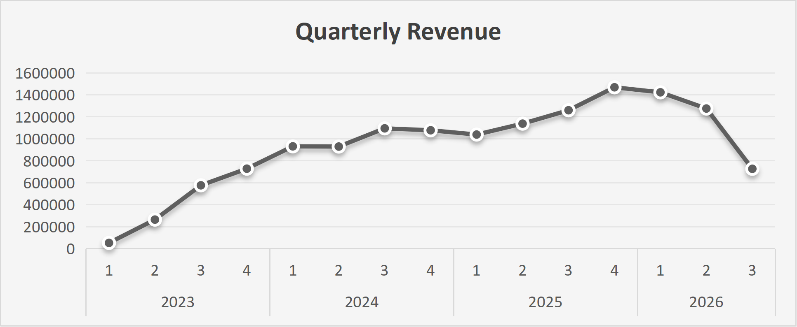
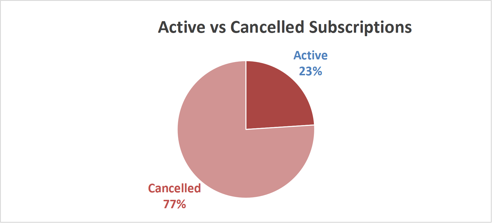
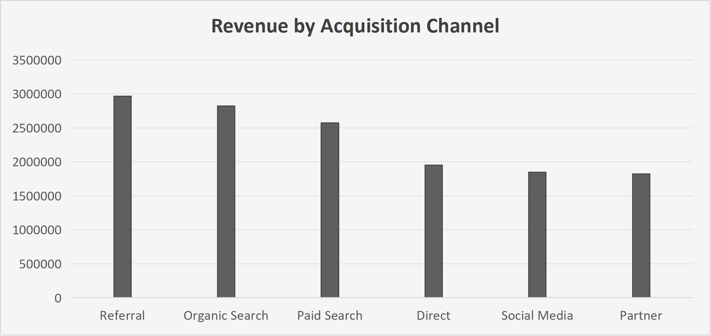

# SaaS Customer and Subscription Analysis
**SQL | Excel | Data Analysis | Business Reporting**

    SELECT
    
    SUM(NetAmount) AS NetRevenue,

    SUM(CASE
        WHEN PaymentStatus = 'Failed'
        THEN NetAmount
    END) AS FailedPayments,

    SUM(CASE
        WHEN PaymentStatus = 'Refunded'
        THEN NetAmount
    END) AS RefundedPayments

   FROM Payments;
## Executive Summary

This project analyses a SaaS business to understand customer acquisition, subscription retention, revenue performance and potential revenue leakage.

The analysis found strong revenue growth from 2023 to 2025, but also a high volume of cancelled subscriptions and significant payment and billing issues. The key business priorities are therefore to improve retention, protect recurring revenue, strengthen the billing experience and measure acquisition by long-term customer value.

The analysis is based on historical data and cannot establish why customers cancel or whether identified relationships are causal. The next step is to investigate customer tenure, cancellation drivers, payment failures, product usage and customer lifetime value, then develop the analysis into an interactive Power BI solution.

## Business Problem

### Why did I do this project?

A SaaS business can acquire a large number of customers and generate strong revenue, but that does not necessarily mean the business is growing sustainably.

Customers can cancel their subscriptions, payment failures can interrupt revenue, refunds can reduce realised income, and support problems can affect the customer experience. At the same time, an acquisition channel that brings in many customers may not necessarily bring in customers who stay longer or generate more revenue.

I wanted to use a realistic relational dataset to look beyond individual numbers and understand how these different parts of a SaaS business connect.

### What problem am I trying to solve?

The main problem is **understanding whether customer acquisition and revenue growth are translating into sustainable customer value**.

The analysis therefore focuses on four areas:

- **Customer growth** — how customers are being acquired and which channels contribute the most.
- **Subscription performance** — how many subscriptions remain active and how many have been cancelled.
- **Revenue and payment health** — where revenue is being generated and whether payment failures or refunds may be creating value leakage.
- **Customer experience** — whether support issues, particularly billing-related problems, may be affecting customers.

The goal is not simply to report numbers. It is to turn the data into practical questions the business can act on: **Where should retention efforts be focused? Which customers and channels create the most value? Where could revenue be leaking? And what should the business investigate next?**

## Business Questions

- How is the customer base growing?
- Which plans, industries and acquisition channels contribute most to revenue?
- How significant are subscription cancellations?
- Are payment failures and refunds creating potential revenue leakage?
- Where are support issues concentrated?
- How can the business improve retention and sustainable growth?

## Methodology

### SQL Analysis

SQL Server was used to analyse the related customer, subscription, payment, product usage, support and marketing data.

The analysis used:

- JOINs
- COUNT, SUM and AVG
- GROUP BY and ORDER BY
- CASE statements
- DATEDIFF
- YEAR, MONTH and DATENAME
- Subqueries and CTEs
- Data quality checks for duplicates, invalid values, missing dates and inconsistent records

The analysis was structured around business questions rather than simply demonstrating SQL functions.

### Excel Visualisation

Excel and XLOOKUP were used to bring related data together for visualisation.

Pivot tables and charts were then used to identify trends and communicate the main findings through a business dashboard.

## Key Findings and Business Actions

### 1. Revenue shows continued growth across the quarters analysed



The quarterly revenue analysis shows that the business generated revenue across the period, with stronger quarters contributing significantly to overall performance.

Revenue increased from just R53.1k in 2023 Q1 to R728.2k in Q4. By 2025, quarterly revenue reached its highest point of R1.47m in Q4.

In 2026, revenue started strongly at R1.42m in Q1, but declined to R1.28m in Q2 and R727.1k in Q3.

The quarterly view provides a more useful picture of how revenue changes over time than simply comparing full calendar years. It also makes it easier to identify periods of stronger or weaker performance that may require further investigation.

**What this means:**  
The business is generating meaningful revenue, but understanding the reasons behind quarterly changes is important if management wants to plan for more consistent and sustainable growth.

**Recommended action:**  
Monitor quarterly revenue alongside customer acquisition, cancellations, payment failures and plan performance to understand what is driving changes in revenue.

---

### 2. Subscription cancellations are the biggest retention concern



There are 3,300 recorded subscriptions, with 772 active and 2,528 cancelled. This means approximately 77% of recorded subscriptions have a cancelled status.

However, this should **not** be interpreted as a formal churn rate because subscriptions started at different times.

**What this means:**  
Customer retention is an important area for further investigation.

**Recommended action:**  
Analyse cancellation by customer tenure, acquisition channel, industry, plan, product usage and payment history to identify potential drivers of cancellation.

---

### 3. Payment and billing issues may be affecting customer value

-- What percentage of payment value is associated with failed and refunded payments?

WITH LostRevenue AS
(
    SELECT
    
        SUM(NetAmount) AS NetRevenue,
        
        SUM(CASE
            WHEN PaymentStatus = 'Failed' THEN NetAmount
        END) AS FailedPayments,
        
        SUM(CASE
            WHEN PaymentStatus = 'Refunded' THEN NetAmount
        END) AS RefundedPayments
        
    FROM Payments
)
SELECT

    FailedPayments * 1.0 / NetRevenue * 100 AS FailedPaymentPercentage,
    
    RefundedPayments * 1.0 / NetRevenue * 100 AS RefundedPaymentPercentage
    
FROM LostRevenue;

The analysis identified 1,074 failed payments and 499 refunds. Failed payments were associated with approximately R813,604, while refunds were associated with approximately R385,799.

Billing was also the most common support issue, with 856 tickets, while its average satisfaction score was approximately 2.9 out of 5.

**What this means:**  
Payment and billing problems appear in both the financial and customer-support data, making them an important area to investigate.

**Recommended action:**  
Improve failed-payment notifications and payment retries, monitor repeated payment failures, investigate refund reasons and determine whether payment problems are followed by subscription cancellations.

---

### 4. Acquisition should be measured by customer value, not only volume



Referral and Organic Search were among the strongest acquisition channels, with 526 and 525 customers respectively.

Referral generated approximately R2.97 million in net revenue, while Organic Search generated approximately R2.82 million.

**What this means:**  
The channel bringing in the most customers is not necessarily the channel creating the most long-term value.

**Recommended action:**  
Evaluate acquisition channels using a broader view of performance: **acquisition cost → retention → revenue → customer lifetime value.**

## Overall Business Priorities

Based on the analysis, the main priorities are:

1. **Improve customer retention**
2. **Protect recurring revenue**
3. **Improve the payment and billing experience**
4. **Measure acquisition quality and long-term customer value**

## Limitations

- The dataset is historical rather than live.
- The 77% cancelled-subscription figure is not a formal churn rate because subscription start dates vary.
- The analysis identifies patterns and relationships but does not establish causation.
- The dataset does not provide enough information to fully explain why customers cancel.
- Customer lifetime value and detailed cancellation reasons would provide deeper insight.
- The current Excel dashboard is static and does not provide interactive filtering or drill-down.

## Next Steps

The next stage of analysis would focus on understanding **why** the patterns identified in this project are occurring.

This could include:

- Cohort retention analysis
- Customer tenure before cancellation
- Payment failures compared with cancellations
- Product usage compared with retention
- Customer lifetime value
- Acquisition cost compared with long-term customer value
- Cancellation reasons and customer segments

From a BI perspective, the analysis can then be developed into an interactive Power BI solution with dynamic KPIs, filters, segmentation and drill-down capabilities.

## Project Deliverables

```text
SaaS-Analytics/
│
├── README.md
├── SaaS_Analysis.sql
├── SaaS_Dashboard.xlsx
├── Business_Report.pdf
├── quarterly-revenue.png
├── subscription-status.png
├── payment-issues.png
└── acquisition-channels.png
```

### Dashboard Preview


## Final Takeaway

The analysis shows a SaaS business generating meaningful revenue across multiple plans and acquisition channels, but sustainable growth depends on more than acquiring customers.

The biggest opportunities are to **retain customers, reduce payment and billing problems, protect recurring revenue and understand which acquisition channels create the most valuable customers**.

The next step is to move beyond describing what happened and investigate why it happened, creating stronger insights that can support better retention, revenue and customer experience decisions.

**Tools:** SQL Server | Excel | XLOOKUP | Pivot Tables | Data Visualisation | Business Analysis
